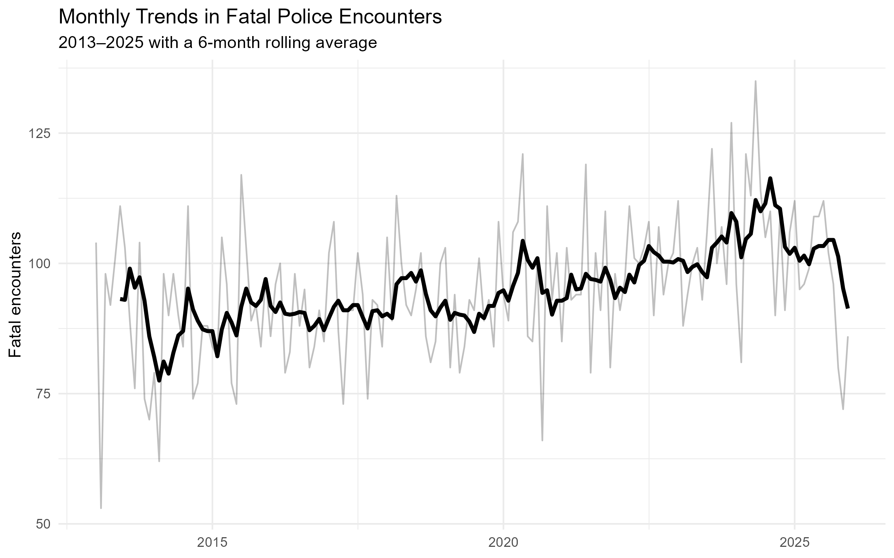
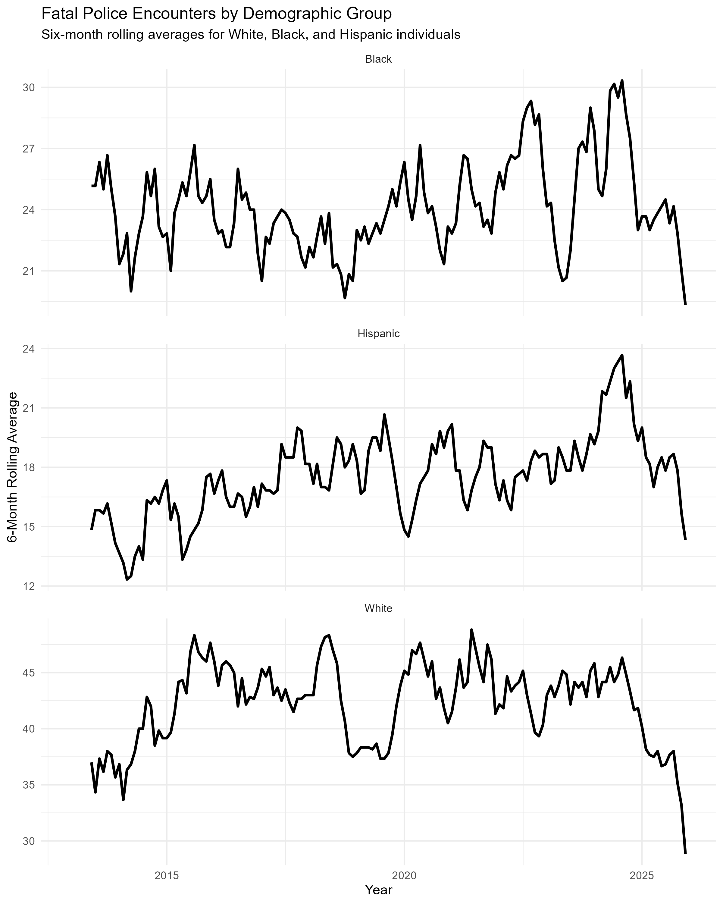

# Police Violence Trends Analysis: U.S. Fatal Encounters (2013–2025)

## Overview

This project analyzes long-term patterns in fatal police encounters in the United States using data from **Mapping Police Violence**.

Using R, I cleaned and summarized records from **2013 to 2025** to examine national monthly trends, six-month rolling averages, and differences in case patterns across major demographic groups.

## Questions

This analysis focuses on three main questions:

1. How have monthly fatal police encounters changed over time?
2. What do six-month rolling averages reveal about longer-term patterns?
3. How do trends differ across White, Black, and Hispanic groups in the dataset?

## Tools Used

- **R**
- **tidyverse** — data cleaning, transformation, and summarization
- **lubridate** — date processing
- **janitor** — column-name cleaning
- **zoo** — rolling-average calculations
- **ggplot2** — data visualization

## Data

The dataset comes from **Mapping Police Violence** and contains records of fatal police encounters in the United States.

The dataset used for this analysis is stored in the [`data`](data/) folder as:

`police_killings.csv`

## Data Preparation

The workflow included:

- Standardizing column names
- Converting incident dates into R date objects
- Removing records with missing incident dates
- Creating broader demographic group categories
- Aggregating incidents by month
- Calculating six-month rolling averages
- Summarizing 2025 cases by demographic group

## Analysis

### National Monthly Trend

Monthly fatal encounter counts were calculated from 2013 through 2025.

A six-month rolling average was added to reduce short-term variation and make longer-term patterns easier to interpret.



### Trends by Demographic Group

Monthly trends were also calculated separately for White, Black, and Hispanic individuals in the dataset.

The figure below compares six-month rolling averages across these groups.



These trends describe the number of cases recorded for each group over time. They should not be interpreted as population-adjusted risk because this analysis does not incorporate population denominators.

## 2025 Demographic Summary

The analysis also calculates the proportion of 2025 cases represented by each demographic group.

These percentages describe the distribution of cases within the dataset and are not estimates of population-level risk.

## Repository Structure

```text
police-violence-trends-analysis/
│
├── data/
│   ├── police_killings.csv
│   └── README.md
│
├── figures/
│   ├── national_pulse.png
│   ├── demographic_divergence.png
│   └── README.md
│
├── scripts/
│   └── police_violence_analysis.R
│
├── .gitignore
├── LICENSE
└── README.md
```

## Reproducing the Analysis

1. Clone or download this repository.
2. Open the project directory in R or RStudio.
3. Install the required packages if necessary:

```r
install.packages(c(
  "tidyverse",
  "lubridate",
  "janitor",
  "zoo"
))
```

4. Run:

```text
scripts/police_violence_analysis.R
```

The script reads the dataset from the `data` folder and saves the visualizations to the `figures` folder.

## Full Project Write-Up

For a more detailed discussion of the analysis, visit:

**[The Full Story: A Decade of Data (2013–2025) — tobiadenola.com](https://tobiadenola.com/the-full-story-a-decade-of-data-2013-2025/)**

## Author

**Oluwatobiloba Adenola**

Data analyst and researcher with experience in R, SQL, statistical analysis, and data visualization.

[Portfolio](https://tobiadenola.com/)
